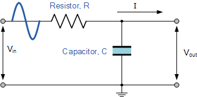
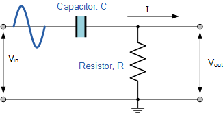
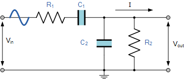

# Introduksjon 

Transmitter -> Communications channel or medium (noise) -> reciever

Transceiver, kan både sende og motta

## Modulering og multipleksing

### Duplex

| Type        | Eksempler                   |
|-------------|-----------------------------|
| Simplex     | GPS, Fjernkontroll          |
| Full duplex | Telefon, WiFi, Sonar, Radar |
| Halv duplex | Begge veier, men kun en samtidig |

### Basisbåndsignaler og Passbåndsignal

| Type            | Beskrivelse                  |
|-----------------|------------------------------|
| Basisbåndsignaler | Ikke modulert, raw signal (høyttaler) |
| Passbåndsignal    | Signal etter modulasjon     |

## Bølgelikningen:

$v = V_p \sin(2\pi ft + \theta)$ eller $v = V_p \sin(\omega t + \theta)$
- $v$: Øyeblikkelig verdi av signalet
- $V_p$: Amplitude
- $f$: Frekvensen til signalet
- $t$: Tid
- $\theta$: Faseforskyvning
- $\omega$: Vinkelfrekvens, $\omega = 2\pi f$

### Modulasjonstyper

| Type  | Beskrivelse                                                                                                 |
|-------|----------------------------------------------------------------------------------------------------------------------|
| AM    | Amplitudemodulasjon: Amplituden av bærebølgen endres i forhold til signalet                                 |
| FM    | Frekvensmodulasjon: Frekvensen av bærebølgen endres i forhold til signalet                                  |
| PSK   | Phase Shift Keying: Fasen av bærebølgen for å lage et binært signal                                         |
| FSK   | Frequency Shift Keying: Frekvensen av bærebølgen endres mellom diskrete verdier for å lage et binært signal |

### Multiplexing

| Type                  | Beskrivelse                                                                 |
|-----------------------|-----------------------------------------------------------------------------|
| Frequency Division    | Hver bruker tildeles en unik frekvensbåndbredde                             |
| Time Division         | Hver bruker tildeles en unik tidsluke                                       |
| Code Division         | Hver bruker tildeles en unik kode som brukes til å skille signalene. Alle brukere kan sende samtidig på samme frekvens, men signalene skilles ved hjelp av unike koder. |

## Det elektromagnetiske spekteret

### Frekvensområder

| Frekvensområde | Frekvens (Hz)          | Eksempler                               |
|----------------|------------------------|-----------------------------------------|
| ELF (Extremely Low Frequency) | 3 - 30 Hz           |                             |
| SLF (Super Low Frequency)     | 30 - 300 Hz         |                             |
| ULF (Ultra Low Frequency)     | 300 - 3000 Hz       |                             |
| VLF (Very Low Frequency)      | 3 kHz - 30 kHz      |                             |
| LF (Low Frequency)            | 30 kHz - 300 kHz    |                             |
| MF (Medium Frequency)         | 300 kHz - 3 MHz     | AM radio (535-1605 kHz)      |
| HF (High Frequency)           | 3 MHz - 30 MHz      |                             |
| VHF (Very High Frequency)     | 30 MHz - 300 MHz    | FM radio (88-108 MHz), MRR (30-88 MHz), DAB radio |
| UHF (Ultra High Frequency)    | 300 MHz - 3 GHz     | Radiolinje                  |
| SHF (Super High Frequency)    | 3 GHz - 30 GHz      | Satcom, WiFi                |
| EHF (Extremely High Frequency)| 30 GHz - 300 GHz    | 5G                          |
| Optisk lys                    |                     | Infrarød, synlig lys        |

## Regler

Forvalter frekvenser:
Sivilt: NKOM
Militært: NARFA

# Kapittel 2

## Gain

| Type       | Formel                                                |
|------------|-------------------------------------------------------|
| Spenningsgain (A_v) | $A_v = \text{gain} = \frac{V_{out}}{V_{in}}$ |
| Effektgain (A_p)    | $A_p = \text{gain} = \frac{P_{out}}{P_{in}}$ |

Totalt gain er **produktet** av alle forsterkergain

### Gain i dB

| Type              | Formel                                      |
|-------------------|---------------------------------------------|
| Desibel (spenning)| $dB = 20\log\frac{V_{out}}{V_{in}}$         |
| Desibel (strøm)   | $dB = 20\log\frac{I_{out}}{I_{in}}$         |
| Desibel (effekt)  | $dB = 10\log\frac{P_{out}}{P_{in}}$         |

Totalt gain er **summen** av alle forsterkergain

| Ratio | Power (dB) | Voltage (dB) |
|-------|------------|--------------|
| 2     | 3          | 6            |
| 10    | 10         | 20           |

Absolutt spenning kan regnes med å ta utgangspunk i mW:

$dBm = 10\log\frac{P_{out}}{0.001W}$

## Fourier

n-te harmoniske av en fundamentalfrekvens

-  $f_n = n*f_\text{fundamental}$
-  $A_n = n*A_\text{fundamental}$

### Båndbredde

Båndbredden er bærebølgen $\plusmn$ signal. Oppstår "sidebånd" i området mellom bærebølgefrekvensen og signalet. (tenk Fourier)

Minimum båndbredde for å sende et stødig signal:

$BW = \frac{1}{t_0}$

### Filter

Vi kan bruke en kondensator for å begrense visse frekvenser fordi $X_c = \frac{1}{2\pi fC}$.

Cut off-frekvensen bestemmes ved der filteret demper med 3dB. Det skjer ved $\frac{1}{\sqrt{2}}$ av gain. Merk at dette blir $\frac{1}{2}$ når 

Cut off-frekvensen kan regnes ut slik: $f_c = \frac{1}{2\pi RC}$

#### Low-Pass

Resistans i serie med $V_{out}$, kondensator i parallell med $V_{out}$

#### High-Pass

Kondensator i serie med $V_{out}$, resistans i parallell med $V_{out}$

#### Band-Pass

Kombinasjon av low-pass og high-pass for å slippe igjennom, eller kutte vekk et bestemt bånd.
